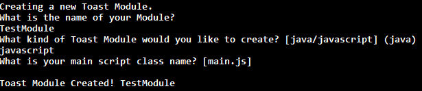
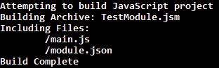

# HotPlate
Toast module building made easy.

## Installation
- Windows
  - Go to [releases](https://github.com/Open-RIO/HotPlate/releases) and download the latest release
  - Double click the ``` ToastInstaller.exe ``` file. (*You may need to start with admin permissions*)
- Mac / Linux
  - Run ``` gem install hotplate ```. (*Sudo may be required*)

## Usage
HotPlate is used from the Command Line. The following commands are valid:  
- ``` toast init ```
  - Will create a Toast module in either Java or JavaScript. The CLI will walk you through all the options for the module and create it in a new folder relative to the current directory.  

  
- ``` toast build ```
  - To be run inside a Module folder. Will build the module and dump it in ``` build/ ``` for JavaScript and ``` build/libs/ ``` for Java.

  
